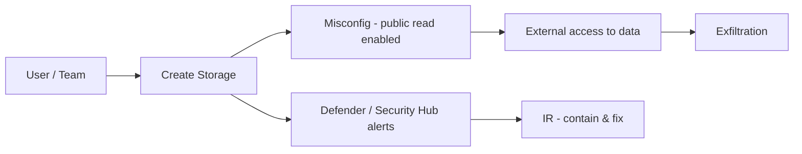
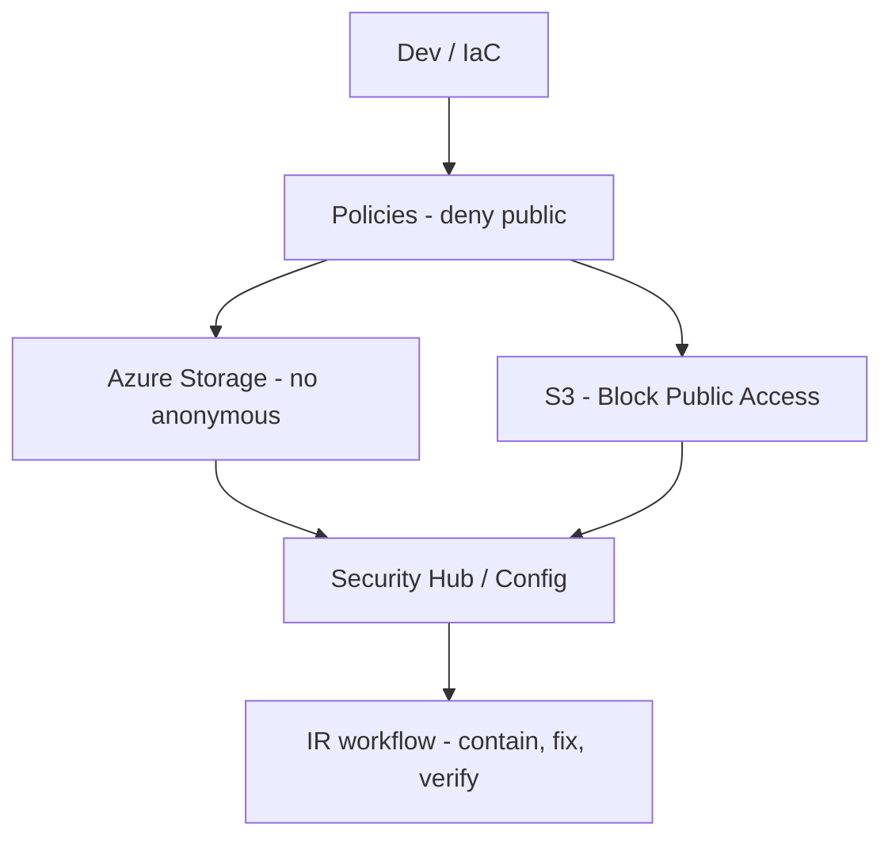

# Cloud Misconfiguration Response Guide (Azure primary, AWS appendix)

## Purpose
Practical, verifiable steps to detect, triage, contain, and prevent **cloud storage misconfigurations** that expose data (e.g., public blob/objects). Focuses on Azure Storage (primary) with an AWS S3 appendix.

> **Why this matters:** Public access on Azure Storage is controlled by the `AllowBlobPublicAccess` account property and related policies; Microsoft’s cloud security benchmark advises disallowing public access by default. On AWS, enable **S3 Block Public Access** at the **account** level and monitor with AWS Config/Security Hub. :contentReference[oaicite:0]{index=0}

---

## Visual: Attack Path (misconfig ➜ exposure ➜ exfiltration)

---

## Real-World Example (sanitized)

A project creates a test container and leaves public read enabled. Logs show anonymous GETs from unfamiliar IPs. After disabling public access and rotating keys, egress stops and alerts close.

> Map attacker outcome to MITRE ATT&CK T1530 – [Data from Cloud Storage](https://attack.mitre.org/techniques/T1530/?utm_source=chatgpt.com). 

## Evidence (what you can run)
- Azure – list accounts with potential public access
  - Resource Graph query (see repo link below) enumerates allowBlobPublicAccess. 
- Azure – Defender for Cloud recommendation
  - “Storage account public access should be disallowed” — verify & remediate. 
- AWS – account-level public access block
  - Verify S3 Block Public Access and bucket status; check AWS Config rules.
    
### Artifacts in this repo (added below):
- [allow-blob-public-access.kql](https://github.com/n22l/cyber-writing-portfolio/blob/main/cloud-security/evidence/azure/resource-graph/allow-blob-public-access.kql)
- [azure-disable-public-access.sh](https://github.com/n22l/cyber-writing-portfolio/blob/main/cloud-security/evidence/azure/cli/azure-disable-public-access.sh)
- [aws-public-access-block.sh](https://github.com/n22l/cyber-writing-portfolio/blob/main/cloud-security/evidence/aws/cli/aws-public-access-block.sh)
- [aws-config-rules.md](https://github.com/n22l/cyber-writing-portfolio/blob/main/cloud-security/evidence/aws/config/aws-config-rules.md)

## Triage (first 30 minutes)
- Snapshot current settings (Azure: account + container; AWS: account/block settings, bucket policy).
- Confirm what could be read anonymously (test URLs, logs).
- Identify when it changed (Activity Log / CloudTrail).
- Decide containment path: block access now; investigate later.

## Containment & Eradication
### Azure
1. Disable public access at account: set AllowBlobPublicAccess to false.
2. Remove container-level public access; require authenticated access only.
3. Enable/verify Defender for Cloud recommendations for Storage. 
### AWS
1. Turn on S3 Block Public Access at the account level (BlockPublicAcls, BlockPublicPolicy, IgnorePublicAcls, RestrictPublicBuckets all true).
2. Remove any bucket policies/ACLs granting Principal: *.
3. Monitor with AWS Config rules s3-bucket-public-read-prohibited / ...-write-prohibited and Security Hub control S3.8.

## Recovery & Hardening

### Azure (baseline)
- Disallow anonymous public access by default; restrict networks; require HTTPS.
- Track/storage recommendations via Microsoft cloud security benchmark baseline for Storage.
### AWS (baseline)
- Keep account-level S3 Block Public Access on; use least-privilege IAM; continuous checks via Security Hub CIS mappings.

---
## Visual: Guardrail Architecture

---
## Controls Crosswalk
| Framework                                  | Relevant Items                     | This Guide’s Mapping                                                                               |
| ------------------------------------------ | ---------------------------------- | -------------------------------------------------------------------------------------------------- |
| **NIST CSF 2.0**                           | PR.AA, PR.DS, DE.CM, RS.MI, RC     | Access control, data protection, monitoring, incident handling, recovery. [1]                      |
| **Microsoft Cloud Security Benchmark**     | Storage baseline controls          | Disallow public access; network restriction; Defender recommendations. [2]                         |
| **CIS AWS Foundations (via Security Hub)** | S3 public access controls (v5.0.x) | Account-level block; bucket policy/ACL checks; continuous assessment. [3]                          |
| **MITRE ATT&CK**                           | T1530 – Data from Cloud Storage    | Threat-informed detection & response. [4]                                                          |

[1]: https://nvlpubs.nist.gov/nistpubs/CSWP/NIST.CSWP.29.pdf?utm_source=chatgpt.com "The NIST Cybersecurity Framework (CSF) 2.0"
[2]: https://learn.microsoft.com/en-us/security/benchmark/azure/baselines/storage-security-baseline?utm_source=chatgpt.com "Azure security baseline for Storage"
[3]: https://docs.aws.amazon.com/securityhub/latest/userguide/cis-aws-foundations-benchmark.html?utm_source=chatgpt.com "CIS AWS Foundations Benchmark in Security Hub CSPM"
[4]: https://attack.mitre.org/techniques/T1530/?utm_source=chatgpt.com "Data from Cloud Storage, Technique T1530 - MITRE ATT&CK®"

## Fact-Check Log
| Date       | Claim                                                            | Source                             |
| ---------- | ---------------------------------------------------------------- | -----------------------------------|
| 2025-11-11 | `AllowBlobPublicAccess` controls anonymous read at account scope | Microsoft Azure docs.              |
| 2025-11-11 | “Storage account public access should be disallowed”             | Defender for Cloud recommendation. |
| 2025-11-11 | S3 Block Public Access at account level recommended              | AWS S3 docs.                       |
| 2025-11-11 | S3 public read/write prohibited checks via Config / Security Hub | AWS docs.                          |

