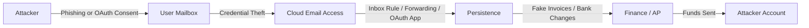

# Incident Response Playbook: Business Email Compromise (BEC)

## Purpose
Standardize detection, triage, containment, and recovery for BEC (invoice fraud, payroll diversion, vendor spoofing).

> **Context:** BEC attacks accounted for over $2.9 billion in adjusted losses in 2023 (FBI IC3). They typically exploit valid credentials and social engineering rather than malware.

---

## Visual: Attack Flow Overview

## Severity & Timing

| Classification | Default | MTTD Target | MTTR Target |
|----------------|----------|--------------|--------------|
| BEC Incident | High | < 1 hour | < 24 hours |

##Roles (RACI)##
| Role                 | Responsibility                                  |
| -------------------- | ----------------------------------------------- |
| **IR Lead (R)**      | Coordinate technical response and documentation |
| **Email Admin (R)**  | Logs, rules, OAuth apps, mailbox snapshots      |
| **Finance (A)**      | Freeze payments, validate bank changes          |
| **Legal (C)**        | Assess notification and regulatory obligations  |
| **Comms (C)**        | Prepare internal/external messaging             |
| **Exec Sponsor (I)** | Approve major comms and risk decisions          |

__Detection Signals__

Key indicators (from Microsoft 365, Entra ID, Defender, and Sentinel):

New inbox rules forwarding or deleting messages related to finance/vendors

New OAuth app grants with Mail.Read, Mail.ReadWrite, or offline_access

Impossible travel: rapid sign-ins from distant geographies

Vendor or internal emails requesting urgent banking changes

Multiple failed logins followed by a successful one from a risky IP

Evidence:

incident-playbooks/evidence/kql/inbox-rules.kql

incident-playbooks/evidence/kql/oauth-grants.kql

__Triage — First 30 Minutes__

 Freeze pending wire/ACH or bank detail changes

 Snapshot affected mailboxes (before modification)

 Identify impacted accounts, devices, and OAuth apps

 Confirm with Finance/AP which vendors or invoices are affected

 Determine whether funds were transferred or halted

__Containment & Eradication__

1. Accounts

Reset credentials for affected users

Revoke sessions and refresh tokens

Enforce MFA (preferably phishing-resistant)

2. Mailboxes

Remove malicious inbox rules and external forwarding

Disable organization-wide auto-forwarding if feasible

Purge malicious emails and lures

3. OAuth / Applications

Revoke rogue app consents

Enforce admin review for future consent

4. Finance

Verify all vendor account changes via out-of-band phone calls

Freeze and flag suspicious invoices

5. Evidence

Preserve message traces, rule exports, and sign-in logs

__Recovery__

Restore user access under monitored conditions

Validate mail flow and inbox rules

Confirm no malicious apps or rules remain

Resume payment operations after verification

Conduct awareness briefing with affected departments

__Metrics__
| Metric                        | Description                                         | Source              |
| ----------------------------- | --------------------------------------------------- | ------------------- |
| **MTTD**                      | Detection time from first signal/report             | SOC alert logs      |
| **MTTR**                      | Time to containment (accounts locked/payments held) | IR ticketing        |
| **Forwarding Rule Incidents** | % of cases with rule-based exfiltration             | Exchange audit logs |
| **Funds Protected**           | Dollar value of prevented/recovered loss            | Finance reports     |

__Communication Templates__

Reference supporting templates:

incident-playbooks/evidence/comms-templates/internal-update.md

incident-playbooks/evidence/comms-templates/vendor-notice.md

__Controls Crosswalk__
| Framework                | Relevant Sections                 | Alignment                                    |
| ------------------------ | --------------------------------- | -------------------------------------------- |
| **NIST CSF 2.0**         | ID, PR, DE, RS, RC                | Detection → Response → Recovery              |
| **NIST SP 800-61 r3**    | §3.3–3.4                          | Follows standard IR lifecycle                |
| **CIS Microsoft 365**    | 1.1, 1.2, 2.4, 3.2                | MFA, disable forwarding, logging             |
| **ISO/IEC 27035-1:2023** | 6.2–6.4                           | Incident management & lessons learned        |
| **MITRE ATT&CK**         | T1566, T1078, T1114, T1098, T1110 | Phishing, valid accounts, email exfiltration |

__Real-World Example (Sanitized)__

-Scenario:
Accounts Payable mailbox compromised through OAuth consent to a fake “Invoice Viewer” app.

-Attacker actions:

Created hidden rule moving “Invoice” messages to a subfolder

Sent new bank details to customer

Attempted a $180,000 transfer

-Response:

Finance caught mismatch → IR froze payments

Email Admin found rule and revoked OAuth app

Credentials reset, sessions revoked, lures purged

Customer verified by phone → transfer blocked

Policy update: new consent review workflow

Visual: Incident Lifecycle
flowchart TD
  D[Detect] --> T[Triage]
  T --> C[Containment]
  C --> E[Eradication]
  E --> R[Recovery]
  R --> L[Lessons Learned]

__Fact-Check Log__
| Date       | Claim                                          | Source                               |
| ---------- | ---------------------------------------------- | ------------------------------------ |
| 2025-11-08 | BEC losses exceeded $2.9B in 2023              | FBI IC3 2023 Report                  |
| 2025-11-08 | OAuth indicators observable via CloudAppEvents | Microsoft Learn: Detect OAuth Abuse  |
| 2025-11-08 | Framework mappings verified                    | NIST CSF 2.0, CIS M365, MITRE ATT&CK |
